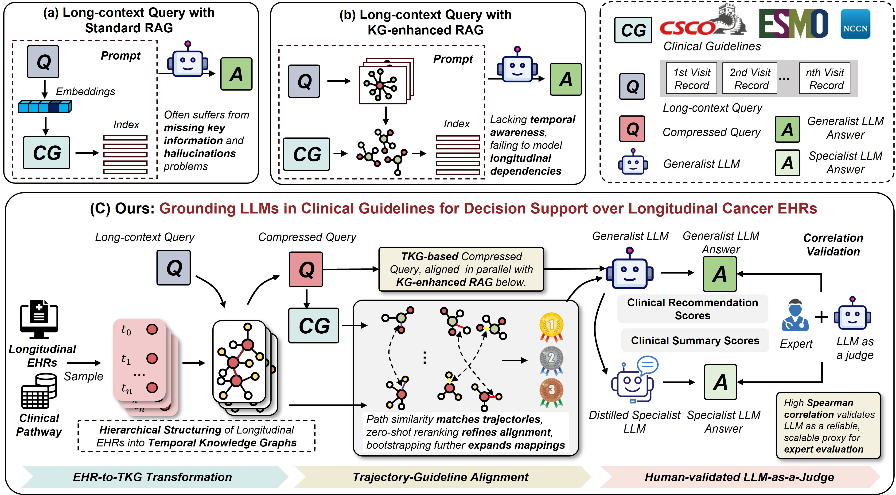

# CliCARE: Grounding Large Language Models in Clinical Guidelines for Decision Support over Longitudinal Cancer Electronic Health Records


## Overview

Our framework bridges the gap between raw patient data and normative clinical knowledge through an end-to-end process, significantly outperforming standard RAG and KG-augmented RAG methods.

<p align="center">
  
</p>

The core workflow of CliCARE consists of three main stages:

### 1. EHR-to-TKG Transformation
We first convert raw, unstructured, and often very lengthy EHRs into structured, patient-specific Temporal Knowledge Graphs (TKGs). This process makes implicit temporal relationships explicit and constructs a coherent graph structure of the patient's complete medical history.

### 2. Trajectory-Guideline Alignment
To suppress hallucinations, we align TKG-based patient trajectories with a normative knowledge graph constructed from authoritative clinical guidelines (such as NCCN, CSCO, ESMO). 

### 3. Grounded Generation and Evaluation
The final, evidence-fused knowledge representation serves as high-quality context for LLMs to generate Clinical Summaries and Clinical Recommendations. We then design evaluation questionnaires for oncologists, calculate Spearman consistency, and achieve high agreement between LLM and human ratings.


## Project Structure

```
CliCARE/
├── Process_data/         # MIMIC-Cancer dataset processing
│   ├── RawData_get/      # Raw data acquisition and preprocessing
│   ├── Cancer_filter/    # Cancer case filtering
│   ├── Longformer/       # Long-text summarization
│   ├── KG/               # Knowledge graph construction
├── KG_Alignment/         # Knowledge graph alignment
├── Experience/           # Model training and evaluation
└── readme.md             # Project documentation
```

## Major Modules

### Data Preprocessing
Convert raw clinical data from CSV to structured JSON format and filter cancer-related cases using keywords and AI models.

### Long Text Summarization
Use Clinical-Longformer model to extract key information from medical records and generate compressed summaries.

### Knowledge Graph Construction
Process clinical guidelines (NCCN, CSCO, ESMO) and build temporal knowledge graphs stored in Neo4j database.

### Knowledge Graph Alignment
Align entities and relations across different knowledge graphs using BERT semantic similarity and LLM re-ranking.

### Clinical Summary and Recommendation Generation
Generate Q&A training data, fine-tune models with LoRA, and evaluate Generation using LLM-as-a-judge.


## Dataset

The project utilizes two main data sources:

- **MIMIC-IV (Open Source):** We leverage the publicly available MIMIC-IV database, integrating multiple hospital admissions for each patient. By using keyword filtering and AI-assisted models, we exclude non-cancer patients and non-cancer-related admissions, retaining only the complete hospitalization trajectories of cancer patients.

- **CancerEHR (Private, Oncology Hospital):** This is a real-world electronic health record (EHR) dataset of cancer patients from an oncology hospital, containing rich clinical treatment processes and follow-up information.


## Usage

To run the KG alignment module, please follow these four steps:

1. **Clone the repository and install dependencies**
   ```bash
   git clone https://github.com/sakurakawa1/CliCARE.git
   pip install -r requirements.txt
   cd CliCARE/KG_Alignment
   ```

2. **Configure Neo4j and API settings**
   - Edit `config.py` with your Neo4j and API information as shown below:
   ```python
   # --- Neo4j Database Connection Configuration ---
   NEO4J_URI = "bolt://localhost:7687"
   NEO4J_USER = "neo4j"
   NEO4J_PASSWORD = "your_password_here" 
   NEO4J_DATABASE = "database" 

   # --- Large Language Model (LLM) API Configuration ---
   OPENAI_API_KEY = "your_key_here"  
   OPENAI_BASE_URL = "https://api.XXX.com"  
   ```

3. **Import guideline KG and clinical TKG into Neo4j**
   
   Load the guideline knowledge graph (KG) and clinical temporal knowledge graph (TKG) data into your Neo4j database before running the alignment.

4. **Run the alignment process**

   ```bash
   python main.py
   ```


## Model Fine-tuning Framework

We utilize [LLaMA-Factory](https://github.com/hiyouga/LLaMA-Factory), an efficient and flexible framework for large language model fine-tuning. LLaMA-Factory supports a variety of training strategies and is well-suited for customizing models to meet the unique challenges of clinical data processing and reasoning.


## Evaluation Metrics

A large language model is used to evaluate system outputs along the following four dimensions, with a score ranging from 1 to 5:

- **Factual Accuracy:** Correctness of information against the patient record
- **Completeness & Thoroughness:** Coverage of all critical clinical aspects
- **Clinical Soundness:** Safety, robustness, and adherence to medical best practices
- **Actionability & Relevance:** Practical value and applicability of the recommendations

## License

This project follows the corresponding open-source license. Please refer to the LICENSE file for details.

## Contact

For questions or suggestions, please contact us via:
- Project Issues: Submit an Issue in the GitHub repository
- Email: dongchen_lee@163.com

---

*Last updated: 2025-07-30*
